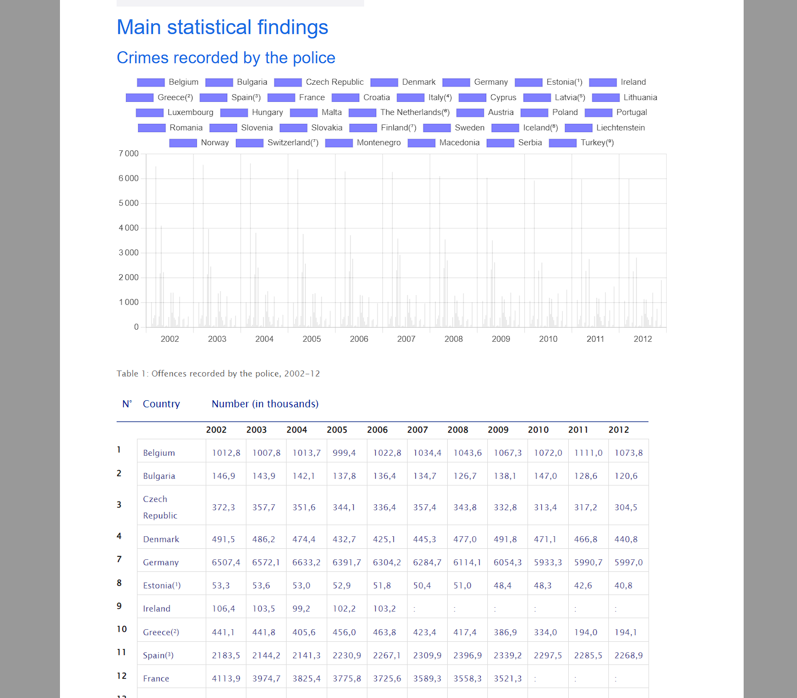
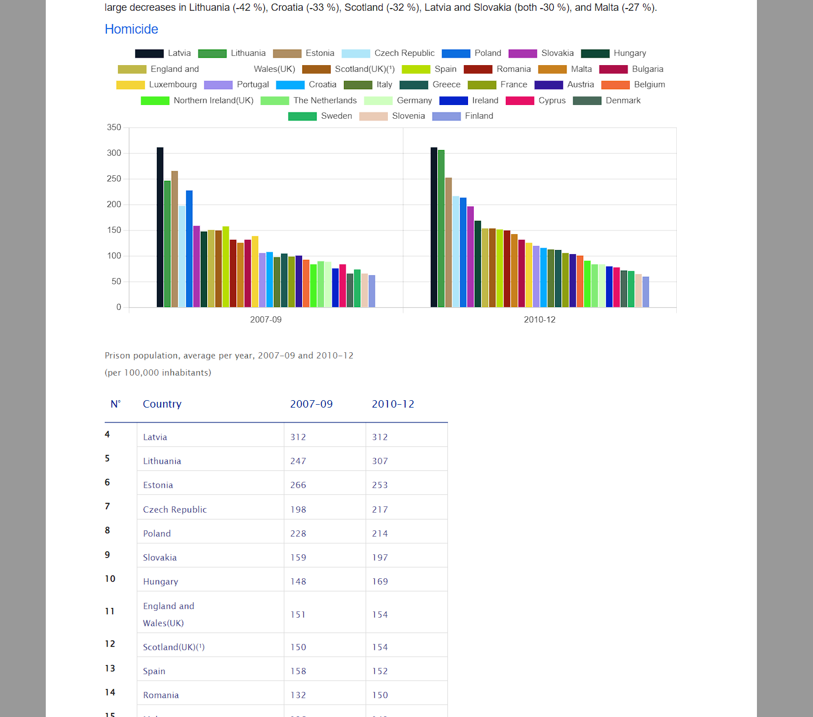
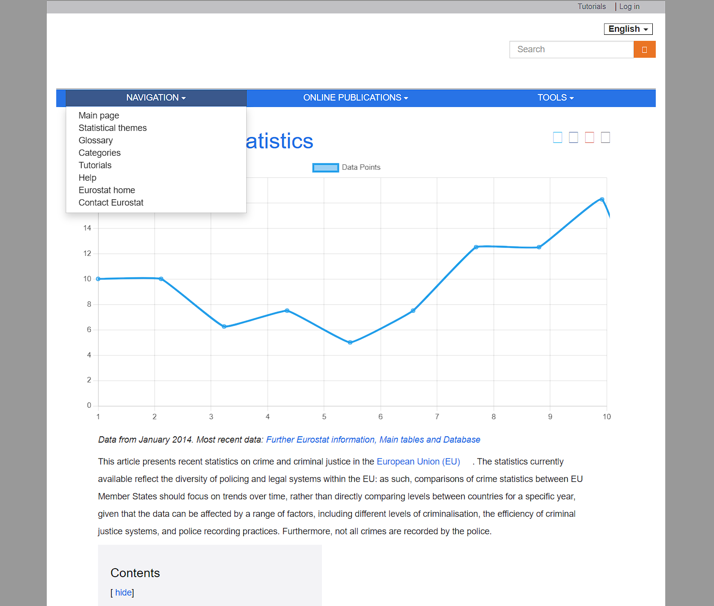

# Data Visualization Exercise

This project is a simple JavaScript data visualization exercise using Chart.js and Vite. The goal is to retrieve data and then create interactive and visually appealing charts to display those inline data and remote data sources.

You can see the app in action [here](https://gerosheng.github.io/javascript-data-visualisation/)

## Preview






## Getting Started

Follow these instructions to get a copy of the project up and running on your local machine.

### Prerequisites

Make sure you have Node.js and npm installed on your machine.

```bash
npm install
```

## Installing

1. **Clone the repository:**

```bash
git clone https://github.com/your-username/data-visualization-exercise.git
```
2. **Navigate to the project directory:**

```bash
cd data-visualization-exercise
```
3. **Install dependencies:**

```bash
npm install
```
## Running the Application

To start the development server, run the following command:

```bash
npm run dev
```

Open your browser and navigate to http://localhost:5173 to see the data visualization in action.

## Chart.js Integration
This project uses Chart.js to create graphs. You can find the official Chart.js documentation [here](https://www.chartjs.org/docs/latest/).

Customize the charts by modifying the data and options in the **`assets/graph.js`** file.

## Project Structure
- `assets/`: Contains the assets and source code files.
- `index.html`: Entry point for the application.
- `node_modules/`: Folder for npm packages, includes Chart.js configurations.
- `vite.config.js`: Vite configuration.

## Contributing

Feel free to contribute to the project by opening issues or submitting pull requests.

## Copyright
10-11-21